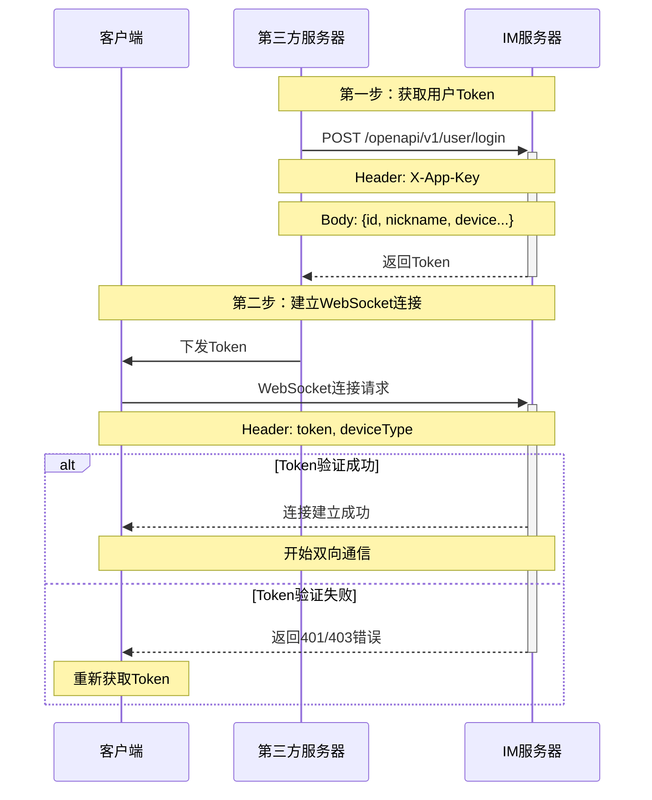

# IM系统登录注册-接入流程说明

## 1. 概述

本文档详细说明了第三方服务如何接入IM系统的完整流程，包括认证、获取token以及建立WebSocket连接等步骤。

## 1.1 流程图



## 2. 接入流程

### 2.1 身份认证

第三方服务在调用IM系统API时，需要进行身份认证。认证信息通过HTTP Header传递：

该参数配置在: **application-common.yml**

```im:
 im:
 	app-key: "keyAbcd123" 
```

| Header 名称 | 说明 | 示例值 |
|------------|------|--------|
| X-App-Key | 分配给第三方的唯一应用标识 | im_app_123456 |

### 2.2 用户注册/登录

#### 接口信息

- 第三方服务端请求路径：`/openapi/v1/user/login`
- 请求方式：POST
- Content-Type：application/json

#### 请求参数

```json
{
    "id": "用户唯一标识",
    "nickname": "用户昵称",
    "avatar": "头像URL",
    "device": "设备类型(im_app_ios: iOS端  im_app_android: Android端  im_web: Web端  im_pc_win: Windows端  im_pc_mac: Mac端)",
    "extras": {
        "自定义字段": "值"
    }
}
```

#### 响应结果

```json
{
    "code": 200,
    "msg": "success",
    "data": {
        "imUserVo": {
            "id": "用户ID",
            "nickname": "用户昵称",
            "avatar": "头像URL",
            "userStatus": 1,
            "lastLoginTime": "最后登录时间",
            "extras": {}
        },
        "token": "Bearer eyJ0eXAiOiJKV1QiLCJhbGciOiJIUzI1NiJ9.xxx"
    }
}
```

### 2.3 WebSocket连接

获取到token后，客户端可以通过WebSocket与IM服务器建立连接。

#### 连接地址

```
ws://localhost:9688/ws
```

#### 连接参数

WebSocket连接时需要在HTTP **Header**中携带以下参数：

| Header 名称 | 必填 | 说明 | 示例值 |
|------------|------|------|--------|
| token | 是 | 登录接口返回的token，需要加上Bearer前缀 | Bearer eyJ0eXAiOiJKV1QiLCJhbGciOiJIUzI1NiJ9.xxx |
| deviceType | 是 | 设备类型 | 设备类型 参考{@link org.dromara.common.core.enums.DeviceType} 可选值:im_app_ios: iOS端  im_app_android: Android端  im_web: Web端  im_pc_win: Windows端  im_pc_mac: Mac端 |

#### 连接流程

1. 客户端发起WebSocket连接请求
2. 服务器验证token的有效性
3. 验证用户类型是否为IM用户
4. 验证通过后建立WebSocket连接
5. 连接成功后将用户Channel加入管理器

#### 错误处理

当连接出现错误时，服务器会返回以下错误信息：

| 错误码 | 说明 |
|--------|------|
| 401 | token为空或无效 |
| 403 | 用户类型非法 |

## 3. 安全说明

1. 所有的API调用都需要使用HTTPS
2. token有效期为30天
3. 每个设备类型同时只能维持一个活跃连接
4. 建议在客户端实现token失效自动重连机制

## 4. 最佳实践

### 4.1 客户端实现建议

1. 实现token失效的自动重新登录
2. 实现WebSocket断线重连机制
3. 在网络切换时主动重新建立连接
4. 定时发送心跳包保持连接活跃

### 4.2 服务端注意事项

1. 在分布式部署时注意用户连接的负载均衡
2. 合理设置心跳超时时间
3. 正确处理异常连接的清理
4. 做好用户在线状态的同步

## 5. 错误码说明

| 错误码 | 说明 | 处理建议 |
|--------|------|----------|
| 200 | 成功 | - |
| 401 | 未授权 | 检查token是否正确或是否过期 |
| 403 | 禁止访问 | 检查用户权限是否正确 |
| 500 | 服务器错误 | 请联系技术支持 |

## 6. 示例代码

### 6.1 登录示例 (Java服务端)

```java
public class LoginExample {
    public static void login() {
        String url = "http://im-server/openapi/v1/user/login";
        
        // 构建请求体
        LoginRequest request = new LoginRequest();
        request.setId("user123");
        request.setNickname("张三");
        request.setDevice("android");
        
        // 设置请求头
        HttpHeaders headers = new HttpHeaders();
        headers.set("X-App-Key", "your_app_key");
        
        // 发送请求
        ResponseEntity<LoginResponse> response = restTemplate.exchange(
            url,
            HttpMethod.POST,
            new HttpEntity<>(request, headers),
            LoginResponse.class
        );
        
        // 获取token
        String token = response.getBody().getData().getToken();
    }
}
```

### 6.2 WebSocket连接示例 (JavaScript)

```javascript
function connectWebSocket(token) {
    const ws = new WebSocket('ws://im-server/ws');
    
    // 添加token到header
    ws.addHeader('token', `Bearer ${token}`);
    ws.addHeader('deviceType', 'web');
    
    ws.onopen = () => {
        console.log('连接成功');
    };
    
    ws.onmessage = (event) => {
        console.log('收到消息:', event.data);
    };
    
    ws.onclose = () => {
        console.log('连接关闭');
        // 实现重连逻辑
        setTimeout(() => connectWebSocket(token), 3000);
    };
    
    ws.onerror = (error) => {
        console.error('连接错误:', error);
    };
}
```

## 7. 更新历史

| 版本号 | 更新日期 | 更新内容 |
|--------|----------|----------|
| 1.0.0 | 2024-01-09 | 初始版本 |